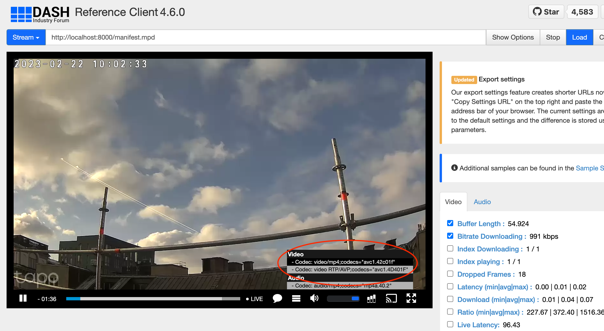

# MPD-WHEP PROXY
> *Minimal proxy server to combine a MPEG-DASH Manifest with a WebRTC WHEP URL*

[](http://slack.streamingtech.se)



## Usage

```sh
npm install
npm start <MPD-URL> <WHEP-URL>
```

or the public Docker

```sh
docker run --rm -d -p 8000:8000 -e MPD=<MPD-URL> -e WHEP=<WHEP-URL> eyevinntechnology/mpd-whep
```

The manifest is now available `http://localhost:8000/manifest.mpd`

## Support

Join our [community on Slack](http://slack.streamingtech.se) where you can post any questions regarding any of our open source projects. Eyevinn's consulting business can also offer you:

- Further development of this component
- Customization and integration of this component into your platform
- Support and maintenance agreement

Contact [sales@eyevinn.se](mailto:sales@eyevinn.se) if you are interested.

## About Eyevinn Technology

[Eyevinn Technology](https://www.eyevinntechnology.se) is an independent consultant firm specialized in video and streaming. Independent in a way that we are not commercially tied to any platform or technology vendor. As our way to innovate and push the industry forward we develop proof-of-concepts and tools. The things we learn and the code we write we share with the industry in [blogs](https://dev.to/video) and by open sourcing the code we have written.

Want to know more about Eyevinn and how it is to work here. Contact us at work@eyevinn.se!
